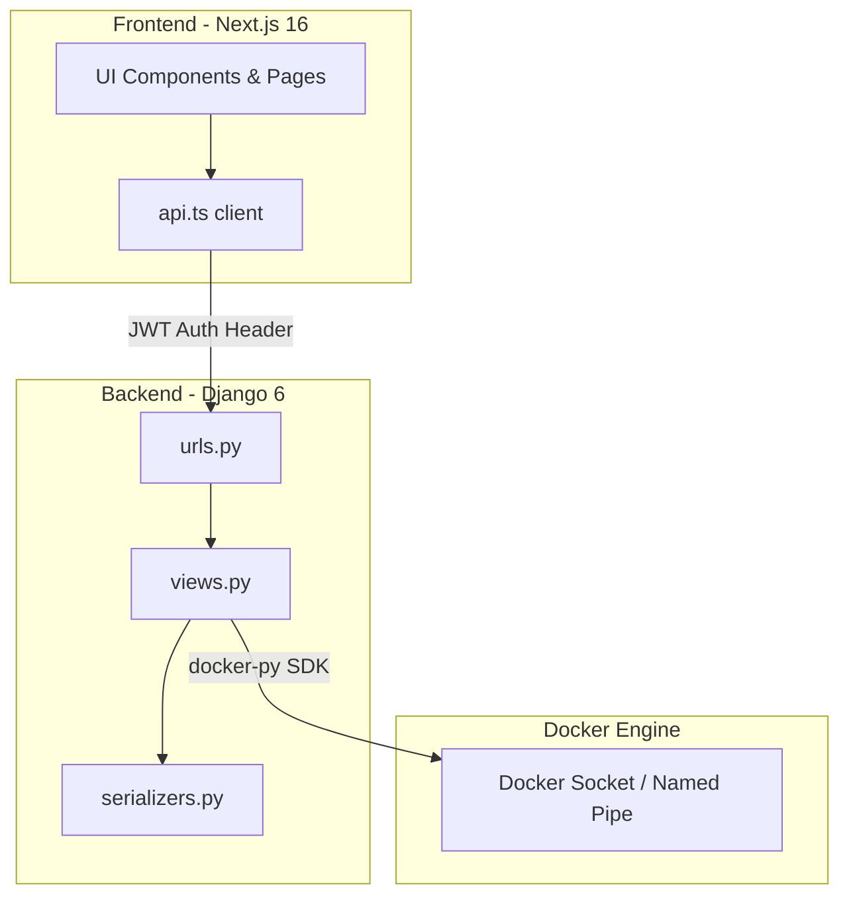

# Plan d'Implémentation Maître - Dockermanager

Ce document est le plan de référence absolu et complet pour le projet **Dockermanager**. Il décrit en détail l'architecture, la structure des fichiers, les dépendances, la logique métier du backend, le design system du frontend et l'ensemble de la logique applicative. Il contient toutes les spécifications nécessaires pour qu'une autre intelligence artificielle ou un développeur puisse recréer cette application de zéro et obtenir exactement le même résultat fonctionnel et visuel.

---

## 1. Architecture Globale & Dépendances

L'application est divisée en deux parties principales :
1. **Un Backend (Django 6.0.5 + Django REST Framework)** qui communique directement avec le démon Docker via le SDK Python officiel (`docker`) pour inspecter et orchestrer les conteneurs, images, volumes et statistiques système. Il est sécurisé par une authentification par jeton JWT.
2. **Un Frontend (Next.js 16.2.6 + Tailwind CSS v4)** structuré avec le App Router de Next.js, s'appuyant sur des icônes Google Material Design et s'intégrant parfaitement avec un système de design clair (light theme) sur mesure.



### Dépendances Backend (`requirements.txt`)
Le fichier doit être installé dans l'environnement virtuel Python (`venv`) :
* `django>=6.0.0` : Framework principal.
* `djangorestframework` : Framework pour concevoir l'API REST.
* `djangorestframework-simplejwt` : Authentification JWT sécurisée.
* `django-cors-headers` : Autorise les requêtes Cross-Origin depuis le frontend.
* `docker` : SDK Python officiel pour interagir avec le socket Docker.
* `pytest`, `pytest-django` : Suite de tests automatisés.

### Dépendances Frontend (`package.json`)
Le package de l'application Next.js contient :
* `"next": "^16.2.6"`, `"react": "19.2.4"`, `"react-dom": "19.2.4"` : Noyau de l'application.
* `"tailwindcss": "^4"`, `"@tailwindcss/postcss": "^4"` : Moteur graphique Tailwind CSS v4.
* `"lucide-react": "^1.14.0"` : Bibliothèque d'icônes vectorielles.
* `"recharts": "^3.8.1"` : Bibliothèque de graphiques interactifs pour le Dashboard.
* `"d3-shape": "^3.1.0"` : **CRITIQUE** - Doit être bloqué à la version `3.1.0` pour éviter la version buggée `3.2.0` (qui est publiée sans dossier `src/` sur npm et provoque des crashs de compilation Next.js/Turbopack).

---

## 2. Configuration & Structure du Backend

### A. Paramètres Généraux (`backend/core/settings.py`)
Le backend doit être configuré pour autoriser CORS, utiliser les JWT et inclure l'application `containers` :
```python
INSTALLED_APPS = [
    'django.contrib.admin',
    'django.contrib.auth',
    'django.contrib.contenttypes',
    'django.contrib.sessions',
    'django.contrib.messages',
    'django.contrib.staticfiles',
    'rest_framework',
    'corsheaders',
    'containers',
]

MIDDLEWARE = [
    'corsheaders.middleware.CorsMiddleware',  # Doit être en premier
    'django.middleware.security.SecurityMiddleware',
    'django.contrib.sessions.middleware.SessionMiddleware',
    'django.middleware.common.CommonMiddleware',
    'django.middleware.csrf.CsrfViewMiddleware',
    'django.contrib.auth.middleware.AuthenticationMiddleware',
    'django.contrib.messages.middleware.MessageMiddleware',
    'django.middleware.clickjacking.XFrameOptionsMiddleware',
]

CORS_ALLOW_ALL_ORIGINS = True # En développement

REST_FRAMEWORK = {
    'DEFAULT_AUTHENTICATION_CLASSES': (
        'rest_framework_simplejwt.authentication.JWTAuthentication',
    ),
    'DEFAULT_PERMISSION_CLASSES': (
        'rest_framework.permissions.IsAuthenticated', # Sécurisé par défaut
    ),
}
```

### B. Serializers de l'API (`backend/containers/serializers.py`)
Toutes les structures de données échangées via l'API REST de Docker sont définies ici :
```python
from rest_framework import serializers

class ContainerSerializer(serializers.Serializer):
    id = serializers.CharField(read_only=True)
    name = serializers.CharField()
    image = serializers.CharField()
    status = serializers.CharField()
    short_id = serializers.CharField()
    ports = serializers.DictField(required=False)
    created = serializers.CharField()

class ContainerCreateSerializer(serializers.Serializer):
    image = serializers.CharField(required=True)
    name = serializers.CharField(required=False)
    ports = serializers.DictField(required=False, help_text="Exemple: {'80/tcp': 8080}")
    volumes = serializers.DictField(required=False, help_text="Exemple: {'my_vol': {'bind': '/data', 'mode': 'rw'}}")
    command = serializers.CharField(required=False)

class ImageSerializer(serializers.Serializer):
    id = serializers.CharField()
    tags = serializers.ListField(child=serializers.CharField())
    size = serializers.IntegerField()
    created = serializers.CharField()

class ImageSearchSerializer(serializers.Serializer):
    name = serializers.CharField()
    description = serializers.CharField(allow_blank=True)
    is_official = serializers.BooleanField()
    star_count = serializers.IntegerField()

class VolumeSerializer(serializers.Serializer):
    name = serializers.CharField()
    driver = serializers.CharField()
    mountpoint = serializers.CharField()
    created_at = serializers.CharField(required=False)

class VolumeCreateSerializer(serializers.Serializer):
    name = serializers.CharField(required=True)
```

### C. Gestionnaire Multi-Plateforme du Client Docker
Pour que le serveur fonctionne de manière transparente sur Windows (avec Docker Desktop) et Linux, la méthode `get_client` tente d'abord de se connecter à l'environnement global, puis bascule sur les canaux spécifiques à chaque OS :
```python
import docker
import platform

def get_client(self):
    try:
        return docker.from_env()
    except Exception:
        if platform.system() == "Windows":
            # Tente les pipes nommés standard de Docker Desktop pour Windows
            for pipe in ['npipe:////./pipe/docker_engine', 'npipe:////./pipe/dockerDesktopLinuxEngine']:
                try:
                    client = docker.DockerClient(base_url=pipe)
                    client.ping()
                    return client
                except:
                    continue
        return docker.DockerClient(base_url='unix://var/run/docker.sock')
```

### D. Endpoints de l'API (`backend/containers/views.py`)
Les vues gèrent l'interaction directe avec le socket Docker :

1. **`ContainerViewSet` (`/api/containers/`)** :
   * `list(request)` : Récupère la liste de tous les conteneurs (actifs et arrêtés) avec leurs mappages de ports et dates de création.
   * `create(request)` : Crée et démarre un nouveau conteneur. Gère l'exception HTTP 409 si le nom existe déjà.
   * `@action start` : Démarre un conteneur arrêté.
   * `@action stop` : Arrête proprement un conteneur en cours d'exécution.
   * `@action restart` : Redémarre un conteneur.
   * `destroy` (DELETE) : Supprime de force un conteneur.
   * `@action logs` : Récupère les logs historiques statiques (par défaut `tail=500` lignes) encodés en texte brut (`text/plain`). Ne doit pas utiliser `stream=True` en synchrone pour éviter de bloquer indéfiniment la requête HTTP.
   * `@action stats` : Renvoie un instantané télémétrique unitaire (CPU, mémoire, réseau).
   * `@action exec` : Exécute une commande shell (`sh -c`) à l'intérieur d'un conteneur en cours d'exécution et renvoie le code de sortie et l'affichage.

2. **`ImageViewSet` (`/api/images/`)** :
   * `list` : Liste les images locales.
   * `@action search` : Recherche des images publiques sur Docker Hub.
   * `@action pull` : Télécharge une image depuis Docker Hub.
   * `destroy` : Supprime une image locale (gère l'erreur 409 si l'image est utilisée par un conteneur).

3. **`VolumeViewSet` (`/api/volumes/`)** :
   * `list` : Liste les volumes persistants.
   * `create` : Crée un volume Docker.
   * `destroy` : Supprime un volume.

4. **`SystemStatsView` (`/api/system/stats/`)** (Méthode GET d'APIView) :
   Récupère les informations système globales de l'hôte et agrège les métriques d'utilisation en temps réel (CPU, mémoire, réseaux, entrées/sorties de blocs) pour chaque conteneur en cours d'exécution :
   ```python
   # Calcul du pourcentage CPU :
   def calculate_cpu_percent(self, d):
       try:
           cpu_count = len(d["cpu_stats"]["cpu_usage"]["percpu_usage"])
       except KeyError:
           cpu_count = d["cpu_stats"].get("online_cpus", 1)
       cpu_percent = 0.0
       try:
           cpu_delta = float(d["cpu_stats"]["cpu_usage"]["total_usage"]) - \
                       float(d["precpu_stats"]["cpu_usage"]["total_usage"])
           system_delta = float(d["cpu_stats"]["system_cpu_usage"]) - \
                          float(d["precpu_stats"]["system_cpu_usage"])
           if system_delta > 0.0:
               cpu_percent = (cpu_delta / system_delta) * cpu_count * 100.0
       except KeyError:
           pass
       return cpu_percent
   ```

### E. Configuration des Routes URL (`backend/core/urls.py`)
```python
from django.contrib import admin
from django.urls import path, include
from rest_framework_simplejwt.views import TokenObtainPairView, TokenRefreshView

urlpatterns = [
    path('admin/', admin.site.urls),
    path('api/token/', TokenObtainPairView.as_view(), name='token_obtain_pair'),
    path('api/token/refresh/', TokenRefreshView.as_view(), name='token_refresh'),
    path('api/', include('containers.urls')),
]
```

---

## 3. Système de Design & Configuration Frontend

### A. Design System Tailwind v4 (`frontend/src/app/globals.css`)
Le frontend utilise un thème clair (light theme) épuré et premium avec des variables injectées directement dans le thème Tailwind :
```css
@import "tailwindcss";

@theme inline {
  --color-primary: #0062a1;
  --color-secondary: #466270;
  --color-tertiary: #006b5c;
  --color-background: #f9f9fc;
  --color-surface: #f9f9fc;
  --color-surface-container: #eeeef0;
  --color-surface-container-low: #f3f3f6;
  --color-surface-container-lowest: #ffffff;
  --color-outline: #707883;
  --color-outline-variant: #bfc7d4;
  --color-on-surface: #1a1c1e;
  --color-on-surface-variant: #404752;
  --color-error: #ba1a1a;
  --color-error-container: #ffdad6;
  --color-on-error-container: #93000a;
  
  --spacing-sm: 8px;
  --spacing-md: 16px;
  --spacing-lg: 24px;
  --spacing-xl: 32px;
  --spacing-sidebar_width: 260px;
  --spacing-max_content_width: 1440px;
  
  --font-body-md: "Inter";
  --font-headline-md: "Inter";
  --font-title-sm: "Inter";
}

body {
  background-color: var(--color-background);
  color: var(--color-on-background);
  font-family: var(--font-body-md);
  min-height: 100vh;
}
```

### B. Configuration de Transpilation (`frontend/next.config.ts`)
Important pour résoudre correctement les exports de charting sans casser Turbopack :
```typescript
import type { NextConfig } from "next";

const nextConfig: NextConfig = {
  transpilePackages: ["victory-vendor", "recharts"],
  devIndicators: {
    appIsrStatus: false, // Cache l'indicateur de compilation en bas de l'écran
  },
};

export default nextConfig;
```

### C. Client API Résistant aux Expérations (`frontend/src/lib/api.ts`)
Le fetcher inclut le token JWT local et intercepte proprement les statuts `401 (Unauthorized)` en bloquant les crashs avec une promesse infinie :
```typescript
export const API_BASE_URL = "http://127.0.0.1:8000/api";

export async function apiFetch(endpoint: string, options: RequestInit = {}) {
  const token = typeof window !== 'undefined' ? localStorage.getItem('token') : null;
  
  const headers: Record<string, string> = {
    'Content-Type': 'application/json',
    ...((options.headers as Record<string, string>) || {}),
  };

  if (token) {
    headers['Authorization'] = `Bearer ${token}`;
  }

  const response = await fetch(`${API_BASE_URL}${endpoint}`, {
    ...options,
    headers,
  });

  if (response.status === 401) {
    if (typeof window !== 'undefined') {
      localStorage.removeItem('token');
      window.location.href = '/login';
    }
    // Empêche Next.js de jeter une erreur de rendu avant la redirection
    return new Promise(() => {}) as unknown as Promise<Response>;
  }

  return response;
}
```

---

## 4. Logique & Design des Pages Frontend

### A. Mise en Page Globale (`layout.tsx`, `Header.tsx`, `Sidebar.tsx`)
Le `RootLayout` structure l'application sur une grille principale :
* **Sidebar** fixe à gauche (`w-sidebar_width`), contenant les liens de navigation, le logo de l'application et le bouton rouge de déconnexion **Sign Out** qui efface le token du `localStorage`.
* **Header** en haut à droite avec un champ de recherche global, des boutons d'actions et l'avatar de l'administrateur flanqué d'un bouton de déconnexion rapide (Logoff) pour le mobile.
* **Zone principale** (`main`) qui scrolle verticalement pour afficher le contenu des pages.

### B. Page de Login (`app/login/page.tsx`)
Une interface claire d'accès sécurisé avec :
* Un fond gris clair (`bg-background`) animé par deux halos colorés (`primary/5` et `tertiary/5`).
* Une carte centrale blanche (`bg-surface-container-lowest`) avec une bordure douce et une ombre portée premium.
* Deux entrées utilisateur (nom d'utilisateur et mot de passe) stylisées avec des icônes d'accompagnement interactives.
* Un bouton d'action bleu (`bg-primary`) qui gère l'état de chargement lors de la requête POST sur `/api/token/`.

### C. Tableau de Bord (`app/dashboard/page.tsx`)
Le centre névralgique de la console, qui rafraîchit ses données toutes les **8 secondes** :
* **Cartes KPI** : Affiche les conteneurs actifs (avec pastille verte pulsante), le nombre d'images locales, l'utilisation globale du CPU et de la mémoire.
* **Graphiques Télémétriques (Recharts)** : 
  * Un graphique en aires pour l'historique d'usage du CPU.
  * Un graphique en aires pour l'historique d'usage de la mémoire RAM.
  * Un graphique d'entrées/sorties réseau (RX/TX) avec des dégradés de couleurs fluides.
  * Un diagramme circulaire (Donut Pie Chart) pour le stockage mémoire global.
* **Tableau des conteneurs récents** : Les 6 derniers conteneurs en cours d'exécution avec leur identifiant, statut et ports associés.

### D. Gestion de Conteneurs (`app/containers/page.tsx` & `create/page.tsx`)
* **Index** : Une vue en tableau complète listant tous les conteneurs du démon Docker avec des boutons rapides pour démarrer, arrêter, redémarrer ou forcer la suppression en bout de ligne.
* **Déploiement (stacked form)** : Une page dédiée organisée de façon ergonomique :
  * Un champ de saisie textuel pour l'image et le nom du conteneur.
  * Deux champs numériques pour mapper le port hôte au port du conteneur.
  * Un menu déroulant `<select>` qui interroge l'API des volumes locaux pour lier de manière sécurisée un volume à un chemin cible.

### E. Page des Volumes Persistants (`app/volumes/page.tsx`)
* **Formulaire Accordéon (Stacked)** : S'affiche en haut de la page au clic sur "Create Volume". Le champ de saisie prend **100 %** de la largeur de la carte (`max-w-2xl`) pour une lisibilité maximale, avec les boutons "Cancel" et "Create Volume" positionnés proprement en bas à droite.
* **Liste de Données** : Un tableau affichant le nom du volume, le pilote de stockage (ex: `local`), le chemin absolu de montage (`mountpoint`) et une icône de suppression de force.

### F. Page des Images (`app/images/page.tsx`)
* **Téléchargement** : Un widget Bento en tête de page avec une barre de recherche. L'utilisateur saisit l'image (ex: `postgres:15`) et clique sur "Pull" ; un spinner s'affiche pendant que l'image est récupérée du Docker Hub.
* **Liste des Images** : Tableau listant les images locales, nettoyant l'identifiant pour extraire le tag et convertissant dynamiquement le poids en octets vers un format lisible (ex: `125.4 MB`).

### G. Terminal de Logs Unifié (`app/logs/page.tsx`)
* Offre une sélection de conteneurs dans un composant déroulant.
* Affiche les 500 dernières lignes de logs dans un conteneur sombre simulant un terminal Linux (`bg-[#1A1C1E]` avec une police à espacement fixe `font-mono text-code-md`).

---

## 5. Guide d'Installation de Zéro

Pour recréer entièrement cette application de zéro :

### Étape 1 : Initialisation du Backend
1. Créer un environnement virtuel Python et l'activer :
   ```bash
   python -m venv venv
   ./venv/Scripts/activate # Windows
   source venv/bin/activate # Linux
   ```
2. Installer les packages :
   ```bash
   pip install django djangorestframework djangorestframework-simplejwt django-cors-headers docker pytest pytest-django
   ```
3. Initialiser le projet Django et l'application `containers` dans le dossier `backend` :
   ```bash
   django-admin startproject core .
   python manage.py startapp containers
   ```
4. Recréer les fichiers de configuration, serializers et vues détaillés dans la section 2 de ce plan.
5. Exécuter les migrations et lancer le serveur :
   ```bash
   python manage.py migrate
   python manage.py runserver
   ```

### Étape 2 : Initialisation du Frontend
1. Créer le projet Next.js sans invite interactive :
   ```bash
   npx -y create-next-app@latest frontend --ts --src-dir --app --tailwind --eslint --import-alias "@/*"
   ```
2. Se positionner dans le dossier `frontend` et installer les modules nécessaires (en verrouillant `d3-shape` !) :
   ```bash
   npm install lucide-react recharts
   npm install d3-shape@3.1.0 --save-exact
   ```
3. Configurer `next.config.ts` et `globals.css` comme spécifié dans la section 3.
4. Ajouter les fichiers d'API et les composants de pages comme spécifié dans la section 4.
5. Démarrer le serveur de développement :
   ```bash
   npm run dev
   ```

L'application est maintenant entièrement fonctionnelle, connectée et prête à orchestrer votre système Docker avec brio.
